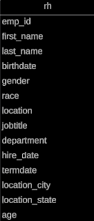

# HR-Data-Analysis

## Project Overview
Conducted a comprehensive data analysis project focused on HR data spanning from the year 2000 to 2020, containing over 22,000 rows. The project involved importing the data into MySQL Workbench for initial processing and cleaning, where I performed some tasks such as handling missing values and standardizing formats. Subsequently, I performed thorough data analysis to extract insights and uncover patterns within the HR dataset. Employing database queries, I conducted an in-depth examination of gender and race/ethnicity demographics, scrutinized age distributions, and investigated employee locations and tenure. Finally, I employed Power BI to create visually appealing data visualizations, including charts, graphs, and dashboards, to effectively communicate the findings and insights derived from the analysis.

## Database Table Schema

The 'rh' table schema represents employee information. Here's a description of each column:

- **emp_id**: An alphanumeric identifier for each employee, with a maximum length of 20 characters.
- **first_name**: The first name of the employee, stored as text.
- **last_name**: The last name of the employee, stored as text.
- **birthdate**: The date of birth of the employee.
- **gender**: The gender of the employee, stored as text.
- **race**: The racial or ethnic background of the employee, stored as text.
- **department**: The department in which the employee works, stored as text.
- **jobtitle**: The job title or position of the employee, stored as text.
- **location**: The location or office where the employee works, stored as text.
- **hire_date**: The date when the employee was hired.
- **termdate**: The date when the employee's employment terminated, if applicable.
- **location_city**: The city where the employee's location or office is situated, stored as text.
- **location_state**: The state where the employee's location or office is situated, stored as text.
- **age**: The age of the employee, stored as an integer.

## SQL Queries Documentation
The script file named "Queries.sql" detailing SQL queries used for data manipulation and analysis within the project. Each SQL statement is accompanied by a comment explaining its purpose and functionality, providing clarity and context for the queries utilized in the project.

## HR Dashboard

## Summary
Through this project, I've developed practical skills in SQL querying, data cleaning, analysis, and visualization, enhancing my proficiency in handling and interpreting HR data effectively.
